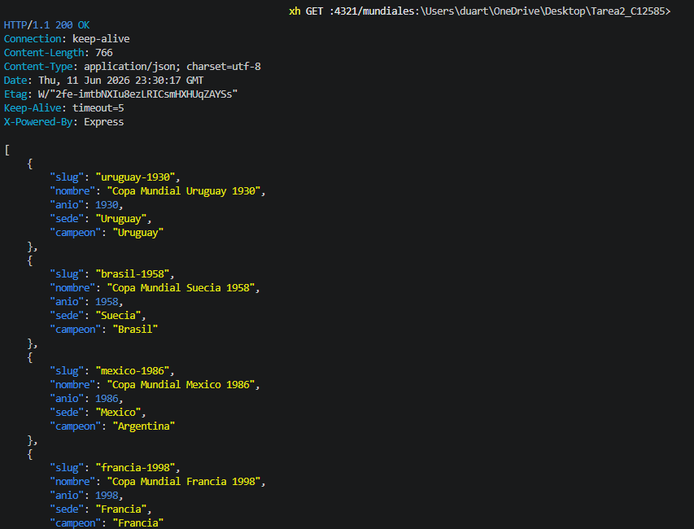
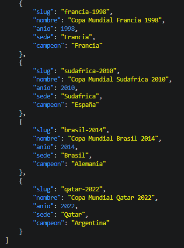
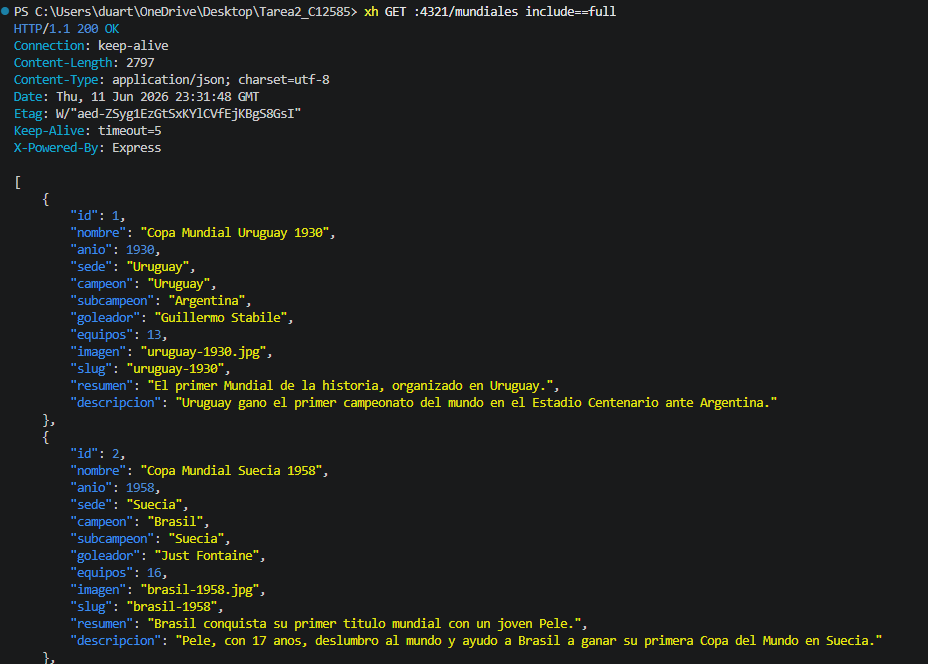
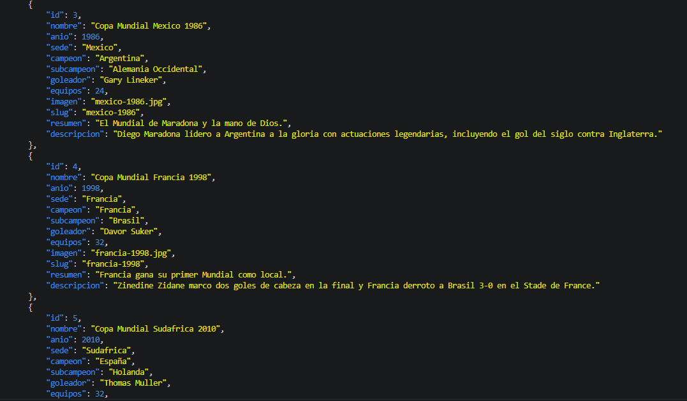
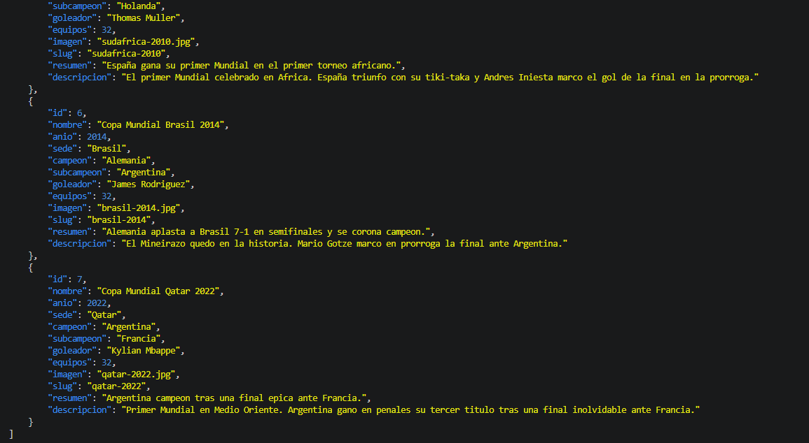
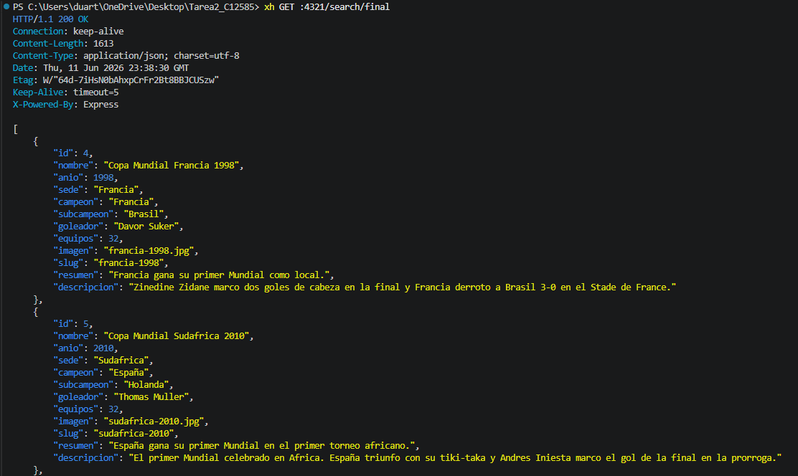
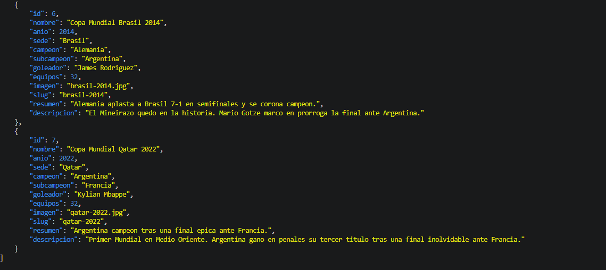
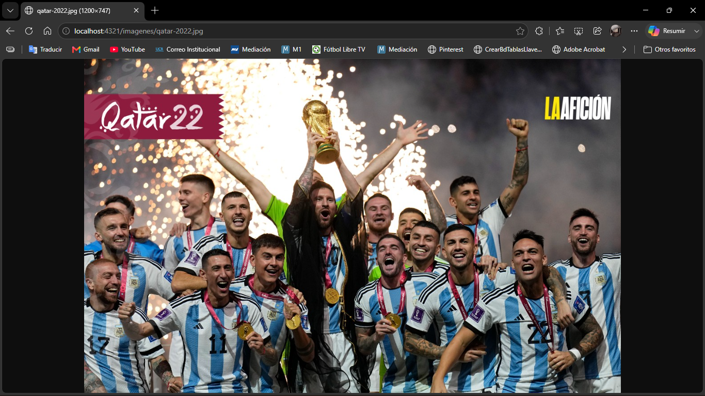

# API Copa Mundial FIFA 🏆

API REST construida con Node.js, Express, SQLite (better-sqlite3) y Zod.

## Requisitos
- Node.js 18+

## Instalación y ejecución

```bash
npm install
npm run seed
npm run dev
```

## Rutas disponibles

| Método | Ruta | Descripción |
|--------|------|-------------|
| GET | / | Información del API |
| GET | /mundiales | Lista resumida |
| GET | /mundiales?include=full | Lista completa |
| GET | /mundial/:slug | Detalle de una edición |
| GET | /campeon/:pais | Mundiales ganados por un país |
| GET | /random | Edición aleatoria |
| GET | /search/:text | Búsqueda por texto (mín. 3 caracteres) |
| GET | /imagenes/:archivo | Imagen de una edición |

## Pruebas con xh

### GET /


### GET /mundiales



### GET /mundiales?include=full




### GET /mundial/:slug


### GET /mundial/:slug — 404


### GET /campeon/:pais


### GET /random


### GET /search/:text



### GET /search/:text — 400


### GET /imagenes/:archivo
